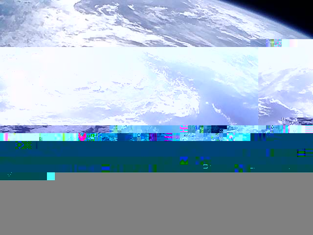
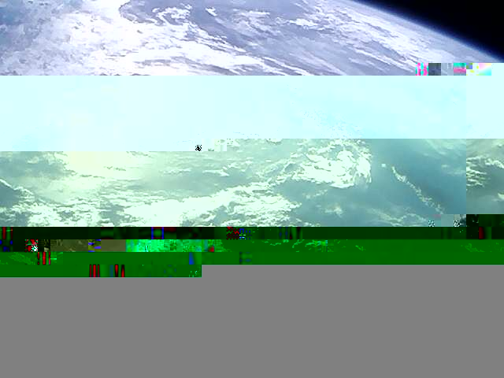

# Lucky 7 Image Decoder

A small C++ program for decoding images from the Lucky-7 cubesat, included are GNURadio flowgraphs for both IQ and FM/AF recordings as well as some sample data from [Derek (@OK9SGC)](https://twitter.com/ok9sgc) and [FelixTRG (@OK9UWU)](https://twitter.com/ok9uwu).

## Usage

Since the project currently consists of only a single source file with no dependencies apart from the standard library, compiling is done manually:

```
g++ -Wall -O2 -o Lucky7-Decoder main.cpp
```

Then to actually run it:

```
./Lucky7-Decoder input.bin output.jpg
```

## Demodulation

You will need the awesome [gr-satellites](https://github.com/daniestevez/gr-satellites) installed in order to use the flowgraphs (example data available [here](https://cloud.xerbo.net/s/jGFk7WNygFoG54T), both IQ and AF).

If you're using the IQ demod:

1. Figure out the sample rate of your recording, say 96000hz
2. Change the sample rate in the flowgraph to match that
3. Change the path on the WAV file source to that of your SDR# IQ recording (input can be changed to F32 rather easily)
4. Select a sane output path and click run

If you're using the FM/AF demod:

1. Figure out the sample rate of your recording, say 48000hz
2. Change the sample rate in the flowgraph to match that
3. Change the path on the WAV file source to that of your recording
4. Select a sane output path and click run

## Exmaple images

Some exmaple images recieved by amatuers with a SDR setup and decoded with this decoder (converted to PNG so they show consistently across devices)




## Protocol

FSK demod, framing, CRC and descrambling is all handled by GNURadio and gr-satellites, and therefore won't be described in this section.

Frames are laid out as such:

 - 1 byte that marks what sort of data is being transmitted (effectively a VCID)
 - 2 bytes for the counter
 - 2 bytes for a copy of the first but with the first 2 bits set to 0 (???)
 - 2 bytes for the number of packets for this transmission
 - 28 bytes of actual data

When an image transmission starts the first counter will always be set to `0xC000` and the first 4 bytes of the JPEG will always be `0xFFD8FFDB`, however due to the nature of the downlink and how missed segments can be resent if needed it is required to sort the frames by their counter and remove repeated frames in order to get a valid data output. After you have the raw data you can just concatenate all the data and write it directly to a JPEG file.

## License

See `LICENSE`
